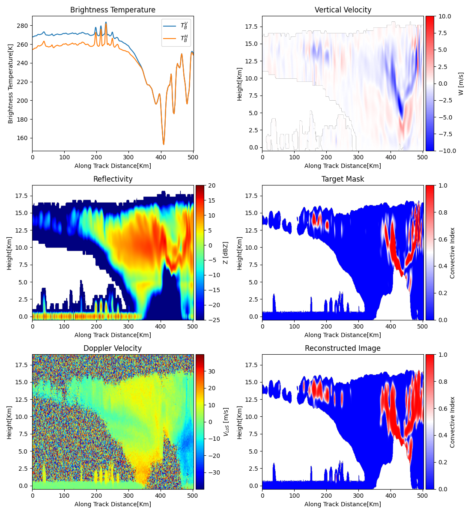
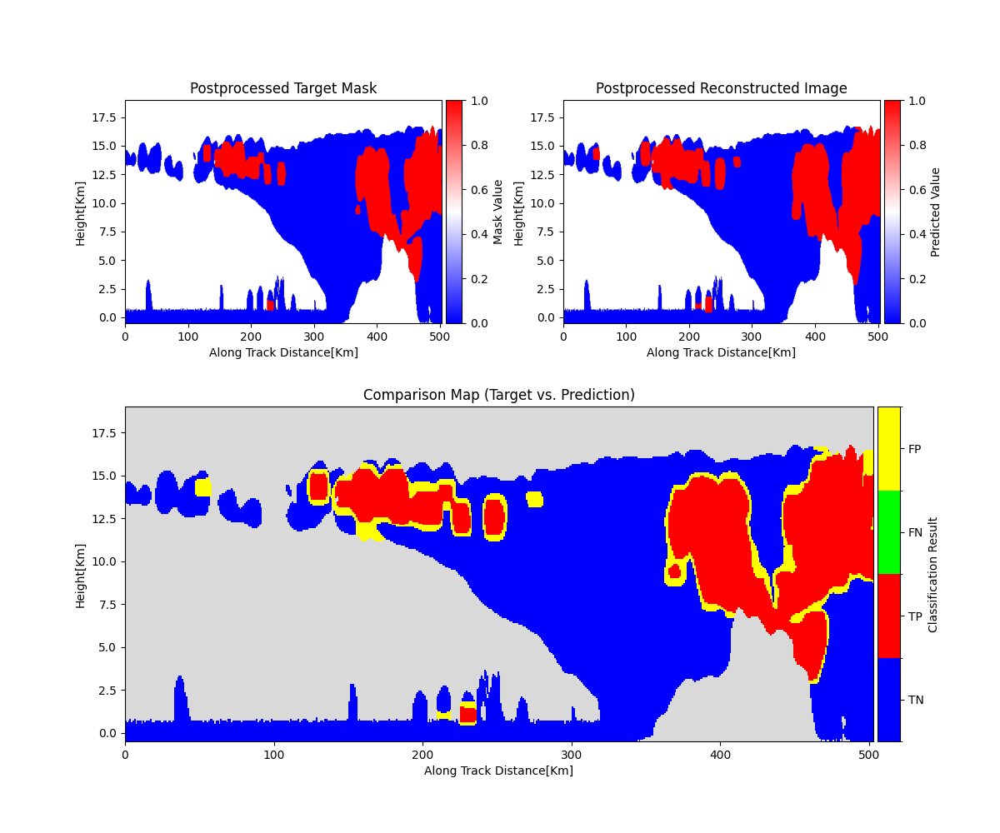

# CONSTRAINN - CONvective-STRAtiform Identification Neural Network

CONSTRAINN is a family of U-Net based neural network models designed to identify convective and stratiform regions in the atmosphere using simulated observables from ESA's [WIVERN mission](https://wivern.polito.it/).


The WIVERN mission promises to deliver the first global observations of the three-dimensional wind field and the associated cloud and precipitation structure. A key component in the development of the mission wind products is the separation between stratiform and convective regions. The latter are defined as regions where vertical wind velocities ($|w|$) exceed $1 \, \text{m/s}$. This work introduces CONSTRAINN, a family of U-Net based neural network models utilizing all of WIVERN observables (vertical profile of reflectivities and Doppler velocities, and brightness temperatures) to reconstruct the convective wind activity in Earth's atmosphere. Results show that the retrieved convective/stratiform masks are well reconstructed with an equitable threat score exceeding 0.6.





## Installation

1.  **Clone the repository:**
    ```bash
    git clone https://github.com/Anatr1/CONSTRAINN.git
    cd CONSTRAINN
    ```

2.  **Create a Python environment** (e.g., using Conda or venv):
    ```bash
    conda create -n constrainn python=3.9
    conda activate constrainn
    ```

3.  **Install dependencies:**

    ```
    pip install -r requirements.txt
    ```

    (Ensure you install the correct PyTorch version for your CUDA setup if using a GPU).

## Data

You can download the reference data used for training from [here](https://huggingface.co/datasets/H4R/WRF-WIVERN-MILTON-THOMPSON-1617-FILTERED-CONTINUOUS-MASK/tree/main)

## Training

The `train.py` script handles the model training process.

Execute `train.py` with the desired network architecture:
```bash
python train.py --network <model_type>
```
Where `<model_type>` can be:
* `mini_unet`
* `medium_unet`
* `large_unet`

Example:
```bash
python train.py --network medium_unet
```
Trained models will be saved in the `../checkpoints/` directory relative to `train.py` (i.e., in the main `checkpoints/` folder of the project).

## Evaluation

The `eval.py` script evaluates trained model checkpoints on the validation dataset.

```bash
python eval.py
```
Ensure that `../checkpoints` contains your trained model files and that `FOLDER` is set correctly. If you trained your model with a different set of input variables you need to adjust the evaluation script accordingly.

## Model Architectures

Three U-Net variants are implemented, differing in depth and initial filter count:

* **`mini_unet.py`**:
    * Parameters: ~8M
* **`medium_unet.py`**:
    * Parameters: ~30M
* **`large_unet.py`**:
    * Parameters: ~500M

## Published Models
You can download trained models from [here](https://huggingface.co/H4R/CONSTRAINN-models/tree/main)


## Acknowledgements
* This research used the Felipe High Performance Computing Facility at the Politecnico di Torino.
* Computational resources were also provided by HPC@POLITO, a project of Academic Computing within the Department of Control and Computer Engineering at the Politecnico di Torino (http://hpc.polito.it).

## Funding
* European Space Agency (ESA) under the activities “WInd VElocity Radar Nephoscope (WIVERN) Phase A Science and Requirements Consolidation Study” (ESA Contract Number RFP/3-18420/24/NL/IB/ab).
* Space It Up project funded by the Italian Space Agency (ASI) and the Ministry of University and Research (MUR) under contract no. 2024-5-E.0 – CUP no. I53D24000060005.

## License
This project is licensed under the GNU General Public License v3.0. For uses not complying with the GPLv3, please contact me to discuss a commercial license.

